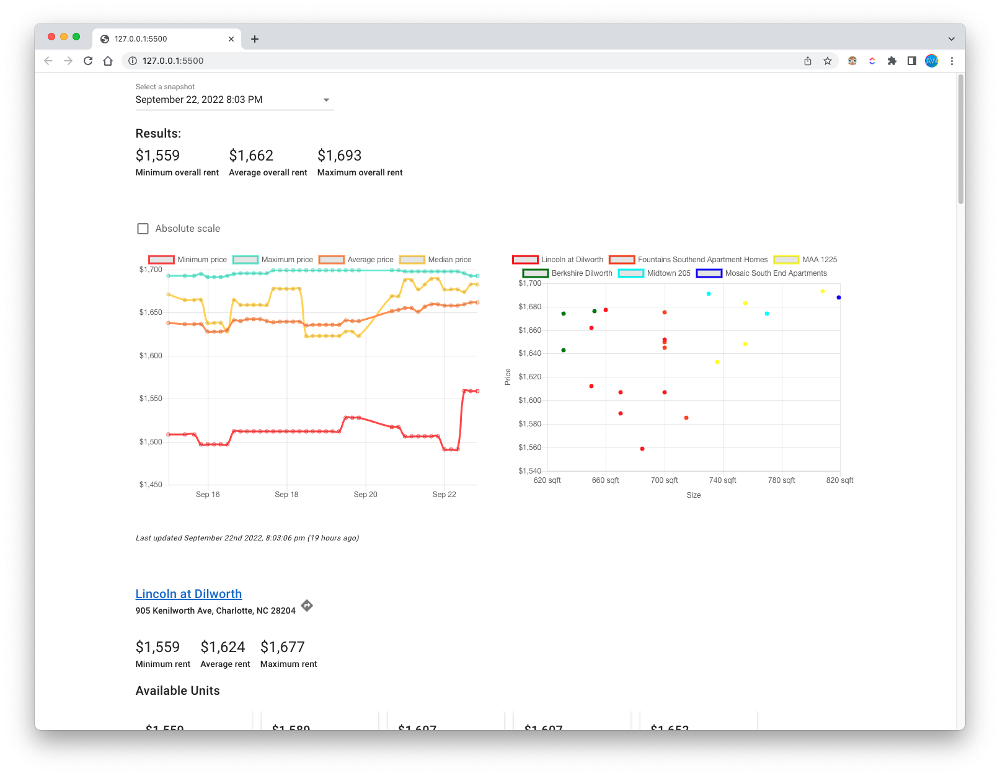
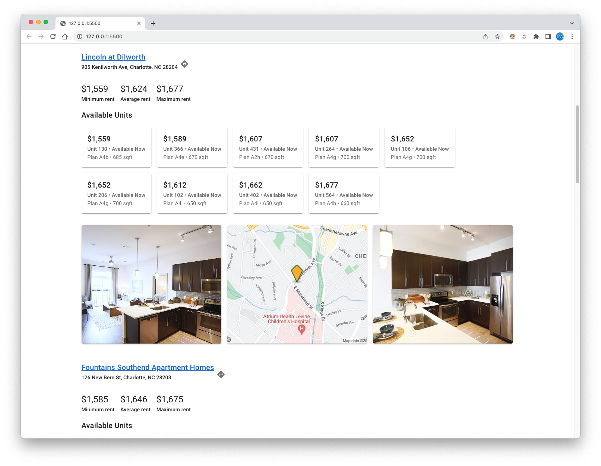

# Apartment finder
Scrapes Apartments.com listings to find the best match for your budget and preferences.

## Screenshots




## Install and run
### Requirements
- Python 3
- Home assistant installation (for push notifications)

### Installation
1. Clone this repository and open it up
2. Create a virtual environment:
```bash
python3 -m venv env
source env/bin/activate
```
3. Install packages:
```bash
pip install -r requirements.txt
```
4. Create a home assistant long-lived access token
    1. Open Home Assistant UI
    2. Go to your profile settings
    3. Scroll to "Long-Lived Access Tokens"
    4. Click "Create Token"
    5. Name token whatever you want
    6. Click "OK"
    7. Copy the token for later
5. Create a .env file and add your Home Assistant token
```bash
HA_URL=YOUR_HOME_ASSISTANT_URL
HA_TOKEN=YOUR_HOME_ASSISTANT_TOKEN
AREA=south-end-charlotte-nc # Get this from URL of an apartments.com search
BEDROOMS=1
MAX_PRICE=1700
MIN_SQFT=600

# Add any apartment names of results you want to blacklist or favorite
BLACKLIST=Centro Square,Timber Creek,Arbor Village,Presley Uptown,MAA Gateway,ARIUM FreeMoreWest,Arlo,The Bryant Apartments,The Griff,Gateway West,Asbury Flats 
FAVORITES=Fountains Southend Apartment Homes
```

6. Create a cron job to run the script on an interval
    1. Create a shell script to execute the python script
   
    `/Users/alexw/Scripts/apartment.sh`:
    ```sh
    #!/bin/sh
    cd /Users/alexw/Desktop/apartment-finder
    source env/bin/activate
    python3 apt.py
    ```

    1. (Mac only) Create a LaunchAgent plist to run the script on an interval
   
    `/Library/LaunchAgents/local.apartment.plist`:
    ```xml
    <?xml version="1.0" encoding="UTF-8"?>
    <!DOCTYPE plist PUBLIC "-//Apple//DTD PLIST 1.0//EN" "http://www.apple.com/DTDs/PropertyList-1.0.dtd">
    <plist version="1.0">
        <dict>
            <key>Label</key>
            <string>local.apartment</string>
            <key>ProgramArguments</key>
      <array>
              <string>/Users/alexw/Scripts/apartment.sh</string> <!-- path to shell script -->
            </array>
      <key>StartInterval</key>
            <integer>14400</integer> <!-- every 4 hours -->
        </dict>
    </plist>
    ```

    1. Activate the LaunchAgent without reboot:
    ```bash
    launchctl load /Library/LaunchAgents/local.apartment.plist
    ```
    You may have to restart the LaunchAgent if you make changes to the plist:
    ```bash
    launchctl unload /Library/LaunchAgents/local.apartment.plist
    launchctl load /Library/LaunchAgents/local.apartment.plist
    ```

7. To view the results, you will need to load your webpage with a local server. The [VS Code Live Server](https://marketplace.visualstudio.com/items?itemName=ritwickdey.LiveServer) extension works well for this. Open the `index.html` file in VS code and click the "Go Live" button in the bottom right corner. The page will refresh automatically when the script updates the data.
